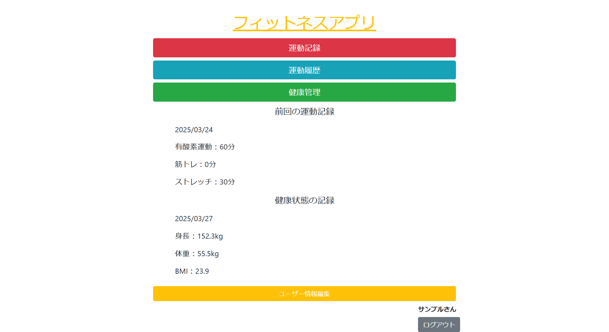
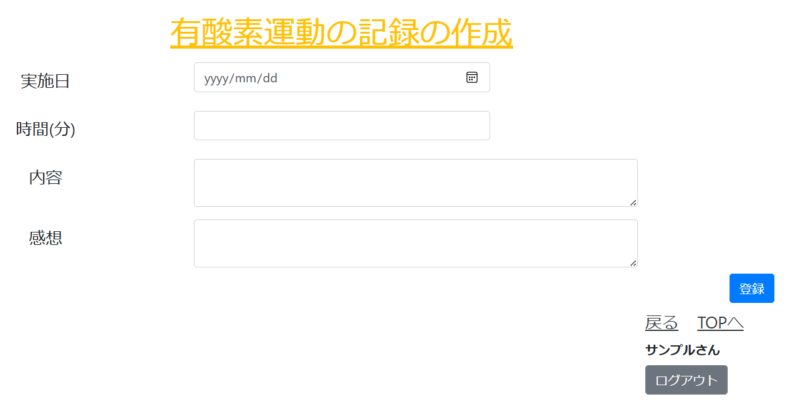
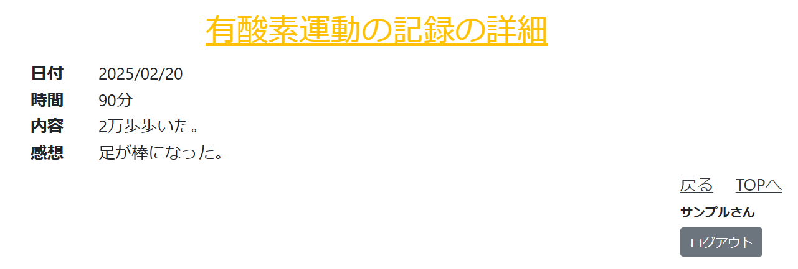
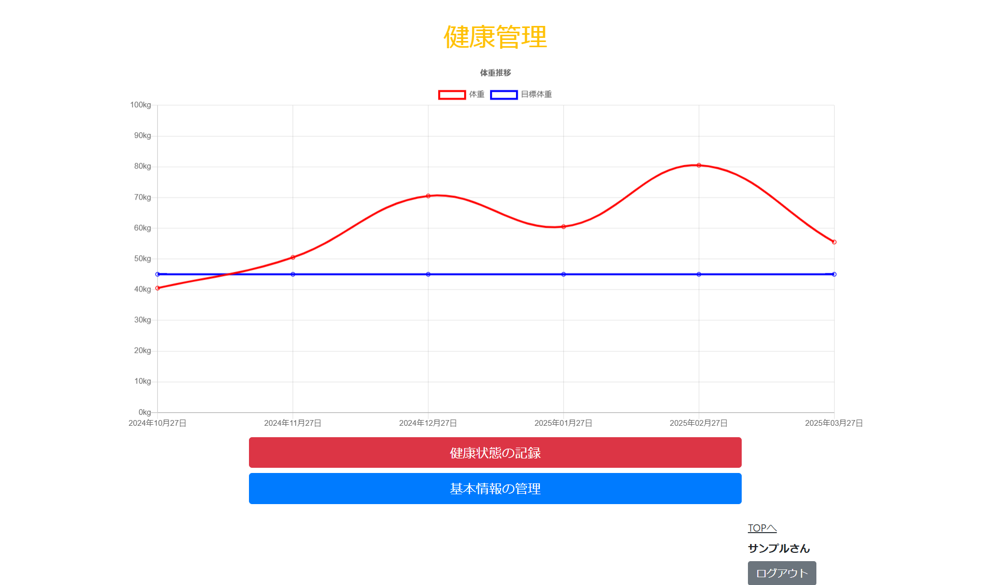
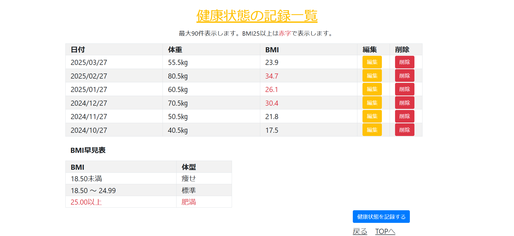

# フィットネスアプリ

運動時間・内容をカテゴリーごとに記録し、履歴を確認できるアプリケーション。

ログイン画面。メールアドレスとパスワードでログインする。

TOP画面。運動記録画面運動、運動履歴画面、健康管理画面、ユーザ情報編集画面を選択できる。

運動記録の選択画面。3つのカテゴリーから選択できる。

運動記録の一覧画面。ボタンから、新規作成、詳細表示、記事編集の画面に移動できる。
削除を選択すると、ダイアログボックスで確認アラートが表示される。

運動記録の作成画面。

運動記録の詳細表示画面。

運動記録の編集画面。初期値として元の値が表示される。

運動履歴の一覧画面。過去30日分の運動履歴のデータを表示する。

健康状態の管理画面。体重の記録の推移と目標体重との比較をグラフで確認できる。

健康状態の記録の一覧画面。基本情報で登録した身長と記録した体重を元にBMIを算出して表示。最大90件分のデータを表示する。

健康状態の基本情報の更新画面。身長と目標体重をいつでも変更できる。基本情報が存在しない場合は登録画面に遷移する。

健康状態の記録の登録画面。入力した数値は小数点第二位で四捨五入される。

ユーザーの新規作成画面。

ユーザー情報の編集画面。初期値として元の値が表示される。

エラー画面。エラー発生時に表示される。

※各入力画面は、バリデーションのエラーがあると入力値を保持したまま入力画面に戻る。

## 概要

  - 運動記録を作成することで、運動への意識を高める。
  - 運動履歴を確認することで、運動習慣を把握する。
  - 体重を記録することで、運動のモチベーションアップを図る。

## 開発した背景

私は、コロナ禍で外出する頻度が減り、体重が増加しました。
運動をして減量を試みましたが、運動の内容や時間が定まらず、長続きしませんでした。
そこで、運動した時間や内容を記録するアプリケーションがあれば、計画的に運動を行えると考え、作成に至りました。

## 使用技術

  - Java 21.0.6 JSP/サーブレット
  - H2

## 機能一覧

  - ユーザー登録、ログイン機能
    - ユーザー情報編集機能
  - 運動記録機能
    - 運動記録の作成・修正・削除機能
    - 運動記録の詳細表示機能
  - 運動履歴機能
    - 運動時間の一覧を表示する機能
    - 運動時間の合計を表示する機能
　- 健康管理機能
    - 健康状態の記録をグラフ化して表示する機能
    - 健康状態の記録の一覧表示機能
    - 健康状態の記録の作成・修正・削除機能
    - 健康状態の基本情報の登録・修正機能
　
## 苦労した点

  - カテゴリーごとで別のレコードにわかれている運動時間を、1つの配列として抽出する為のSQL文の作成(dao/ExerciseDAO/findAllExecercisesメソッド)
  - 体重と目標体重を比較するグラフの描画を行うための変数の作成(servlet/ManagementServlet)
